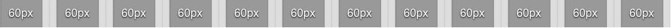
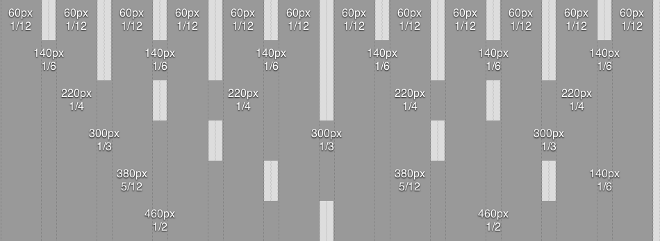
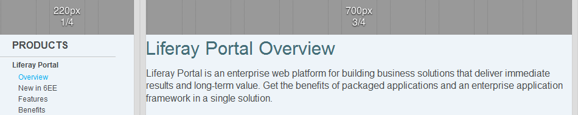
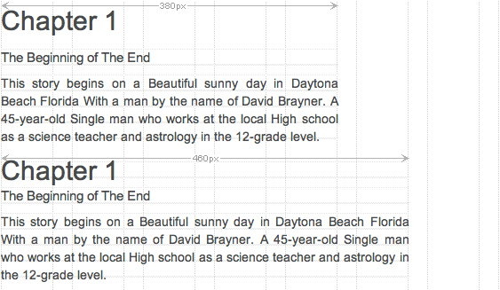
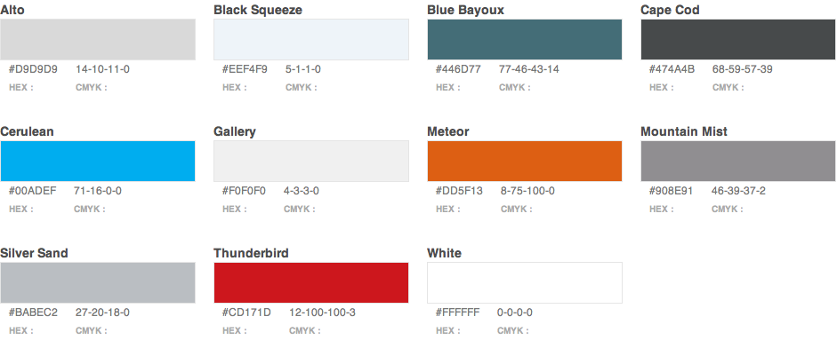

Liferay Website Guidelines
==================================

Layouts and Columns
----------------------------------
The Liferay website uses the 960 Grid System for all pages on the site. The 960 Grid System is an effort to streamline web development workflow by providing commonly used dimensions, based on a layout width of 960 pixels.

Each page layout is divided into 12 even portions. Each portion is 60 pixels wide with 10 pixels of margin on the left and the right, with all 12 portions filling the available 960px width of the layout.

Makes more sense when you see it, right?

The page layout 960px was chosen for its size and divisibility. All modern monitors support at least 1024x768px of resolution, so 960px easily fits into this standard. The number of 960 is also a highly flexible base number, as it is divisible by 2, 3, 4, 5, 6, 8, 10, 12, 15, 16, 20, 24, 30, 32, 40, 48, 60, 64, 80, 96, 120, 160, 192, 240, 320 and 480.

## Layout in Action
A typical Liferay page layout will have a left column reserved for navigation. The left column will have a width of 220px, which is 1/4 the page layout. The remaining right column will have a width of 700px, which is 3/4 the page layout.

## Typography
Strong typography forms the backbone of any brand identity; it is a major contributor to a brand's visual style and tone. Fonts are chosen with three key considerations: their fit with brand values, readability and flexibility of use. Limiting the number of fonts is key to maintaining a distinctive visual style and ease of brand management.

The Liferay website chose one font; Helvetica! ... which really meant Arial for Windows, which meant yet another sans-serif for everbody else. Whenever possible, the website uses Arial at 12px for all text on the site.

## Headings
Headings are pretty simple - they are big versions of the regular text. The website gives all H1 elements a 2.5em font size with a 0.4em bottom margin, which equates to a 30px font size with a 12px bottom margin. The website gives all H2, H3 elements a 1.333em font size with a 0.375em bottom margin, which equates to a 16px font size with a 6px bottom margin. The website gives all H4, H5, H6 elements a 1.166em font size with a 0.428em bottom margin, which equates to a 14px font size with a 6px bottom margin.

Why didn't the Liferay website use straight-up pixels? The website uses pixels, but headings need flexibility. Word.

## Measure

When a typographer refers to "the measure", they mean the width of the text body. Simply put, when copy is too wide or poorly spaced it becomes difficult to read.

The general rule for a comfortable measure is around 60 - 70 characters per line. Taking into account that each character averages out to around 0.5em in width, setting a measure of 33em should keep each line within the optimum range. Since the Liferay website defaults to a 12px Arial font, we would desire a number close to 396px (33 * 12). The closest and most ideal layout portions for the text body are therefore 5/12 (380px) and 1/2 (460px).

## Colors

The Liferay website references color names by Resene Paints Ltd. as matched by the Name That Color website.

## Borders, Corners, and Shadows

The Liferay website uses a consistent set of borders, border radii, and shadows to enhance the branding appeal and continuity of all pages. In most situations, banners and boxes have a css3-based border radius of 10px on all four corners. For browsers not supporting the border radius property, banners and boxes appear square. In many situations, banners and boxes will also have a css3-based box shadow which is aligned 1px beneath the element and with 2px of blurring. Again, for browsers not supporting the box shadow property, banners and boxes appear shadowless.

## Components

### Page Heading
- Font Family: Arial, Helvetica, san serif
- Size: 30px
- Line Height: 1.2 (36px)
- Weight: Bold
- Color: Blue Bayoux
- Margin Bottom: 12px (0.4em)

### Page Heading Description
- Font Family: Arial, Helvetica, san serif
- Size: 16px
- Line Height: 1.25 (20px)
- Weight: Normal
- Margin Bottom: 18px (1.125em)

### Page Subheading / Section Heading
- Font Family: Arial, Helvetica, san serif
- Size: 16px
- Line Height: 1.25 (20px)
- Weight: Bold
- Margin Bottom: 4px (0.25em)

### Section Subheading
- Font Family: Arial, Helvetica, san serif
- Size: 14px
- Line Height: (18px)
- Weight: Bold
- Margin Bottom: 4px

### Caption / small
- Font Family: Arial, Helvetica, san serif
- Size: 9px
- Line Height: 1.333 (12px)
- Weight: Normal
- Color: Mountain Mist
- Vertical Margin: 9px (1em)

### Paragraph
- Font Family: Arial, Helvetica, san serif
- Size: 12px
- Line Height: 1.5 (18px)
- Weight: Normal
- Color: Cape Cod
- Vertical Margin: 9px (.75em)

### Fine Print
- Font Family: Arial, Helvetica, san serif
- Size: 9px
- Line Height: 1.5 (18px)

## Common Elements

### Button
- Font Family: Arial, Helvetica, san serif
- Size: 12px
- Line Height: 1.5 (18px)
- Weight: Bold
- Color: White
- Margin Bottom: 3px
- Background Color: Cerulean
- Border Radius: 3px
- Padding: 3px, 20px
- Box Shadow: 0 1px 2px rgba(0,0,0,0.7)
- Cursor: Pointer
- Highlighted Background Color: Meteor

### Tab Box
- Margin Bottom: 9px
- Background Color: Gallery
- Background Gradient: Alto to Gallery
- Border Radius: 5px
- Padding: 12px, 20px
- Box Shadow: 0 1px 2px rgba(0, 0, 0, 0.7)

-----------------------
